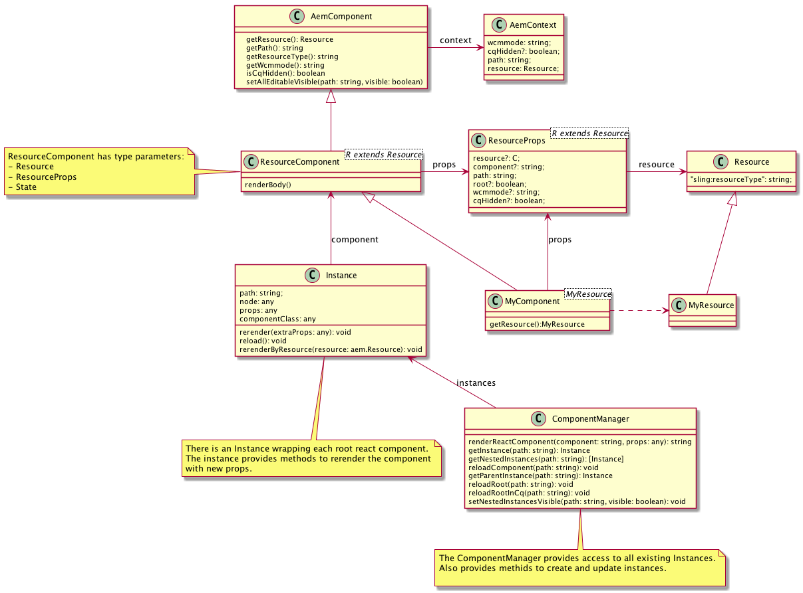
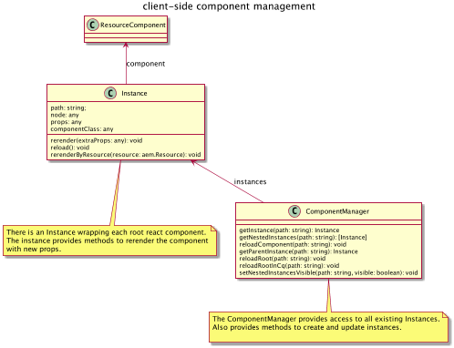

# AEM React integration module

This npm module  is required by the [AEM React Integration project](http://www.github.com/sinnerschrader/aem-react).
This library is written in TypeScript.

## Basic usage

The ComponentManager finds react components defined in the mark up and instantiates them. The markup must provide the following:

```html
...
<div id="MyReactComponent" data-react-id="<path>_component">
</div>
```   

<path> is usually the jcr resource path of the associated AEM component.

The Rect component props are a json string inside of a textarea:

```html
<textarea id="<path>_component">
{
    "component":"MyReactComponent",
    "path":"/content/demo/jcr:content/par/a",
    "root":true,
    "resource":{
        "text":"This is a text"
    }
}
</textarea>

```

To register components and map them to resourceTypes:

```javascript

// register all React Components and map to resourceTypes
let registry: ComponentRegistry = new ComponentRegistry("react-demo/components");
registry.register(Text);
let rootComponentRegistry: RootComponentRegistry = new RootComponentRegistry();
rootComponentRegistry.add(componentRegistry);
rootComponentRegistry.init();
```

To initialize the components in the client:

```javascript
// create the componentManager
let componentManager: ComponentManager = new ComponentManager(rootComponentRegistry);

// find and render all components
componentManager.initReactComponents();

// provide global access for inline scripts rendered on the server
declare var AemGlobal: any;
AemGlobal = {componentManager: componentManager};

```  

To initialize the components on the server:

```javascript


// create the ServerRenderer
let serverRenderer: ServerRenderer = new ServerRenderer(rootComponentRegistry);

// make renderer available to Java via a global variable:
declare var AemGlobal: any;
if (typeof AemGlobal === "undefined") {
    throw "this is not the server side AEM context";
}
AemGlobal.renderReactComponent = serverRenderer.renderReactComponent.bind(serverRenderer);

```  

## Notes

Currently using typescript@next because we get a weird error otherwise:

````
router/AemLink.tsx(4,38): error TS4020: Extends clause of exported class 'AemLink' has or is using private name 'Link'.
````

## API








## Trouble shooting`

### Error during rendering on server only

```
Caused by: java.lang.ArrayIndexOutOfBoundsException: 8
        at java.lang.invoke.MethodHandleImpl$ArrayAccessor.getElementL(MethodHandleImpl.java:130)
        at jdk.nashorn.internal.scripts.Script$Recompilation$42327$242230AA$\^eval\_.L:6890$instantiateReactComponent(<eval>:6975)
        at jdk.nashorn.internal.scripts.Script$Recompilation$42422$495489AAA$\^eval\_.L:14349$instantiateChild(<eval>:14379)
        at jdk.nashorn.internal.scripts.Script$Recompilation$42420$464731AAAA$\^eval\_.L:13343$traverseAllChildrenImpl(<eval>:13445)
```
Does not happen in env==production
